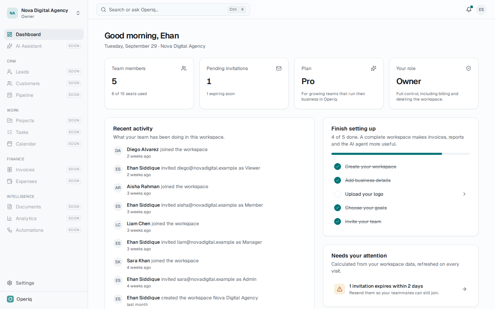
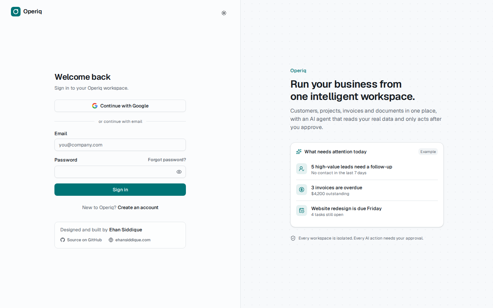
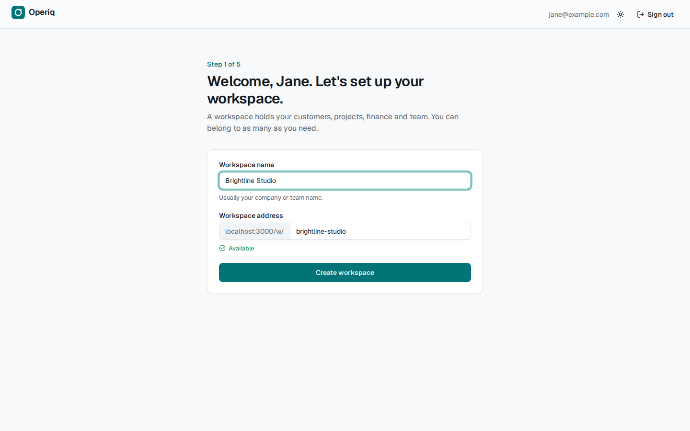
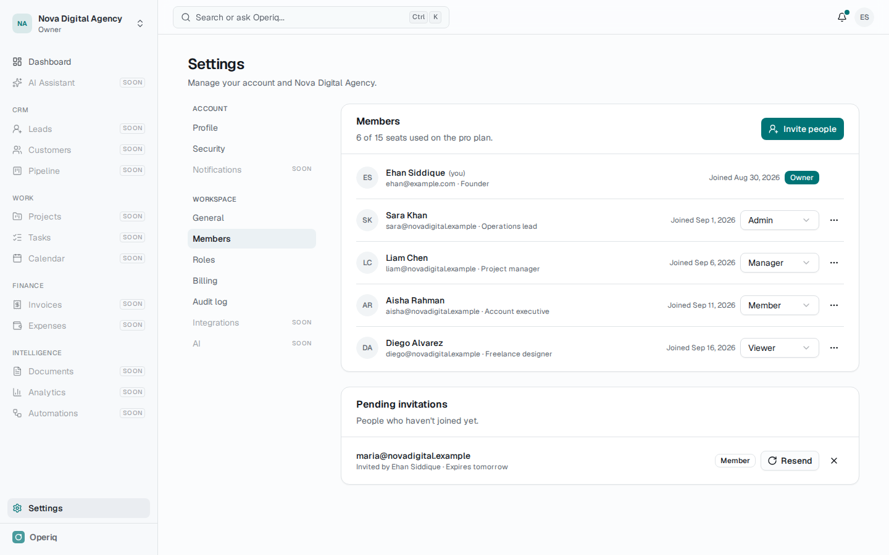
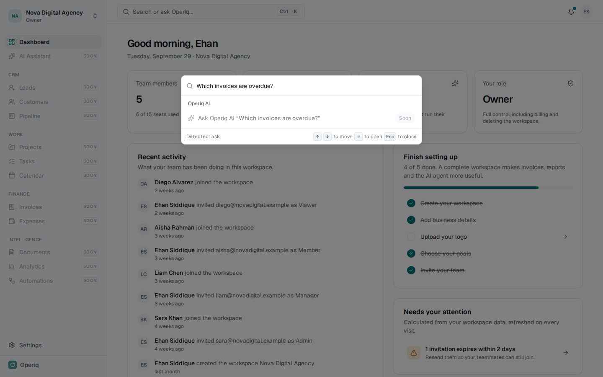
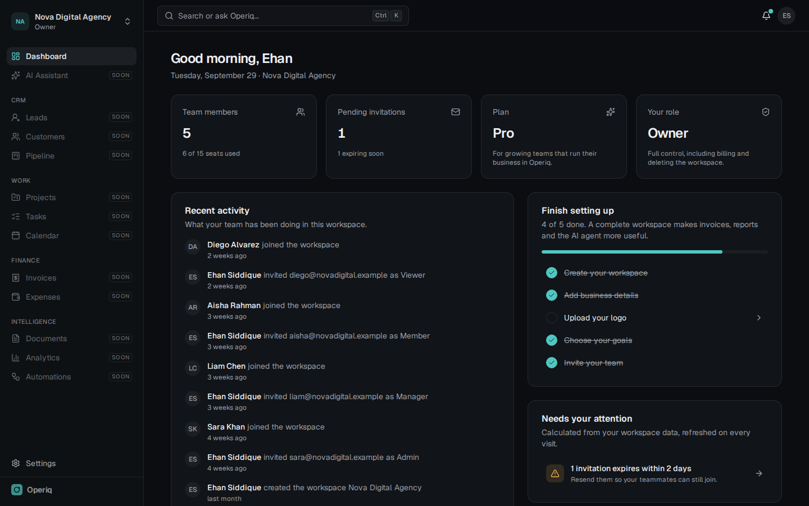
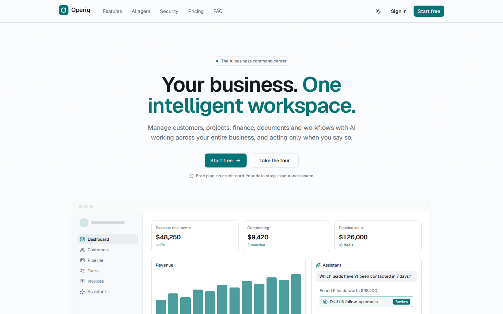
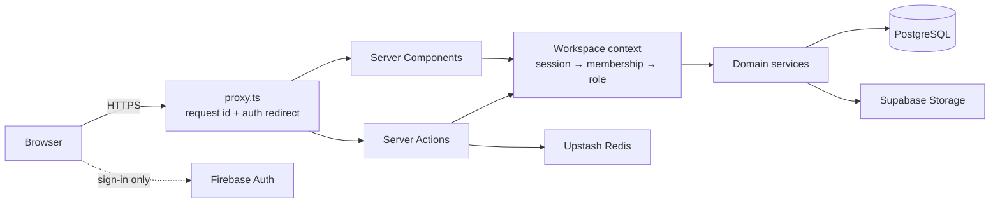
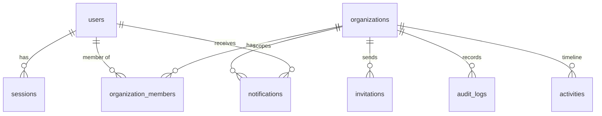

<div align="center">

# Operiq

**Your business. One intelligent workspace.**

CRM, projects, finance, documents and workflows in one place, with an AI agent that understands
your business data and only acts after you approve.

[](https://github.com/Fehan999/Operiq---Run-your-business-from-one-intelligent-workspace./actions/workflows/ci.yml)




</div>

## What Operiq is

Small businesses run on a stack of disconnected tools: a CRM, a project board, an invoicing app,
a shared drive and a chatbot that knows nothing about any of them. Operiq brings those areas into
one multi-tenant workspace so customers, work, money and documents share the same data, team
and permissions.

The AI agent is not a chat window bolted on the side. It will work with real workspace data
through typed, permission-checked tools, and anything that writes data or leaves the workspace
(sending an email, an invoice) is shown as a proposal that a person approves first. Every step
lands in an append-only audit log.

## Status

Operiq is built in phases ([roadmap](docs/roadmap.md)). **Phase 1, the foundation, is complete:**

- Email/password and Google sign-in, email verification, password reset
- Database-backed sessions with device list and revocation
- Multi-tenant workspaces with URL-based tenancy (`/w/<slug>`)
- Five roles with server-enforced permissions and a pure, tested member policy
- Invitations with hashed, email-bound, expiring links
- Onboarding wizard: workspace, business details, logo, goals, team
- Workspace shell: sidebar, workspace switcher, Cmd/Ctrl+K command bar with intent detection,
  notification center, light/dark themes, mobile navigation
- Dashboard built only from real data, with rule-based insights
- Settings: profile, security, workspace, members, roles matrix, plan and seats, audit log
- Append-only audit log enforced by a Postgres trigger, plus a product activity feed
- Central plan entitlements, rate limiting, structured logging, security headers
- Marketing site with SEO metadata, Open Graph image, sitemap, robots and structured data
- Unit, component, integration (real Postgres) and end-to-end (Playwright) tests, CI, Docker

CRM is next, then projects, finance, and the AI agent.

## Screenshots

| Sign in                                           | Onboarding                                       |
| ------------------------------------------------- | ------------------------------------------------ |
|             |    |
| **Members and roles**                             | **Command bar**                                  |
|           |  |
| **Dark mode**                                     | **Landing page**                                 |
|  |          |

## Tech stack

| Layer          | Choice                                                                |
| -------------- | --------------------------------------------------------------------- |
| Framework      | Next.js 16 (App Router, Server Components, Server Actions, Turbopack) |
| Language       | TypeScript (strict, `noUncheckedIndexedAccess`)                       |
| UI             | React 19, Tailwind CSS 4, shadcn/ui on Radix, lucide icons, Motion    |
| Forms          | React Hook Form + Zod (the same schemas validate on the server)       |
| Database       | PostgreSQL 16, Prisma 7 with the `pg` driver adapter                  |
| Authentication | Firebase Auth for identity, own session table for access              |
| Storage        | Supabase Storage (S3-compatible)                                      |
| Rate limiting  | Upstash Redis REST, in-memory fallback                                |
| Email          | Resend (optional)                                                     |
| Testing        | Vitest, React Testing Library, Playwright                             |
| Tooling        | ESLint, Prettier, GitHub Actions, Docker                              |

## Architecture



A modular monolith organised by domain: `src/modules/<domain>` holds schemas, services, server
actions, pure policies and UI for that domain; `src/app` only contains routes. Business logic
never lives in components. Details in [docs/architecture.md](docs/architecture.md).

```
src/
  app/          routes: (marketing), (auth), onboarding, invite, w/[slug]
  modules/      auth, organizations, members, invitations, audit, activity,
                notifications, onboarding, dashboard, command, marketing, users
  components/   ui (shadcn), shared, layout
  lib/          db, env, errors, logging, security, storage, email, firebase
  config/       navigation, plans, site, workspace options
prisma/         schema, migrations, seed
tests/          unit, components, integration
e2e/            Playwright specs
```

### Data model



Every business table carries `organization_id`. Indexes follow real query patterns, a partial
unique index keeps one open invitation per email, and a trigger makes the audit log append-only.
See [docs/database.md](docs/database.md).

### Authentication

Firebase verifies who someone is. The server verifies the Firebase ID token against Google's
public keys (no service account needed), then issues its own opaque session token in an httpOnly
cookie and stores only its hash. Sessions can be listed and revoked instantly.
See [docs/authentication.md](docs/authentication.md).

### Multi-tenancy and RBAC

The workspace is resolved from the signed-in user's membership, never from an id sent by the
browser alone. Every query is scoped by `organization_id`, every server action re-checks
permissions, and non-members get a 404. Integration tests try to cross tenants and must fail.
See [docs/authorization.md](docs/authorization.md).

### AI and RAG (designed, not yet built)

The agent will call typed tools with Zod schemas, risk levels (read, write, external) and the
same permission checks as the user. Writes and external actions become stored proposals that a
person approves; the server re-validates before executing and records everything in the audit
log. Document answers will come from workspace-scoped vector search with citations.
See [docs/roadmap.md](docs/roadmap.md).

## Security model

- Server-side authorization on every mutation, tenant-scoped queries everywhere
- Hashed session and invitation tokens, httpOnly SameSite cookies, fresh sign-in for new sessions
- Zod validation on all input, magic-byte checks on uploads, SVG refused
- Rate limits on sign-in, invitations, uploads and workspace creation
- Append-only audit log enforced by the database
- Security headers, `noindex` on private routes, redacted structured logs

Known gaps are listed honestly in [docs/security.md](docs/security.md).

## Getting started

### Prerequisites

- Node.js 22 (see `.nvmrc`)
- PostgreSQL 16, local or via `docker compose up -d`
- A Firebase project with Email/Password and Google sign-in enabled
- A Supabase project with a public bucket named `Operiq` (for logos and avatars)

### Setup

```bash
git clone https://github.com/Fehan999/Operiq---Run-your-business-from-one-intelligent-workspace..git operiq
cd operiq
npm install
cp .env.example .env.local        # then fill in the values
docker compose up -d              # optional: Postgres + Redis
npm run db:migrate                # create tables
npm run dev                       # http://localhost:3000
```

Sign up, create a workspace, and you're in. For a populated demo workspace, run
`SEED_OWNER_EMAIL=you@example.com npm run db:seed` after signing up once.

### Environment variables

| Variable                               | Required  | Purpose                                                         |
| -------------------------------------- | --------- | --------------------------------------------------------------- |
| `NEXT_PUBLIC_APP_URL`                  | local     | Public URL for links and SEO; on Vercel defaults to its domain  |
| `DATABASE_URL`                         | yes       | Runtime Postgres connection (pooler in production)              |
| `DIRECT_URL`                           | migrate   | Session connection for Prisma migrations                        |
| `NEXT_PUBLIC_FIREBASE_*`               | yes       | Firebase web app config                                         |
| `NEXT_PUBLIC_SUPABASE_URL`             | uploads   | Supabase project URL                                            |
| `NEXT_PUBLIC_SUPABASE_PUBLISHABLE_KEY` | uploads   | Publishable key                                                 |
| `SUPABASE_SECRET_KEY`                  | advised   | Server-only key so the bucket stays closed to anonymous writes  |
| `SUPABASE_STORAGE_BUCKET`              | no        | Defaults to `Operiq`                                            |
| `RESEND_API_KEY`, `EMAIL_FROM`         | no        | Invitation emails; without them, invite links are shown to copy |
| `UPSTASH_REDIS_REST_URL`, `_TOKEN`     | no        | Shared rate limiting; falls back to in-memory                   |
| `CRON_SECRET`                          | on Vercel | Authenticates the daily cleanup job                             |
| `NEXT_PUBLIC_AUTHOR_LINKEDIN_URL`      | no        | Overrides the LinkedIn link in the author credit                |
| `LOG_LEVEL`                            | no        | `debug`, `info`, `warn` or `error`                              |

## Testing

```bash
npm test                  # unit + component tests (Vitest)
npm run test:integration  # against a real Postgres (TEST_DATABASE_URL, default operiq_test)
npm run test:e2e          # Playwright; starts the app automatically
npm run lint && npm run typecheck
```

| Suite       | What it covers                                                                                                                              |
| ----------- | ------------------------------------------------------------------------------------------------------------------------------------------- |
| Unit        | Permission matrix, member policy, Firebase token checks, slugs, uploads, rate limits, schemas, command intent, insights, app URL, cron auth |
| Components  | Author credit, buttons, password field, form errors, empty states                                                                           |
| Integration | Tenant isolation, invitations end to end, seat limits, owner protection, append-only audit log, sessions, expired record cleanup            |
| End to end  | Public pages and headers, auth redirects, full onboarding, command bar, invites, viewer read-only, cross-workspace 404, mobile nav          |

End-to-end tests sign in by writing a session row directly, the same row a real sign-in creates,
so they don't depend on Google and the app has no test-only login route.

## Docker

```bash
docker compose up -d                   # infrastructure for local development
docker compose --profile app up -d     # plus migrations and the production image
```

The image uses Next.js standalone output, runs as a non-root user and includes a health check.

## Deployment

Vercel for the app, Supabase for Postgres and storage, Firebase for auth, Upstash for Redis.
All have free tiers. Step-by-step guide: [docs/deployment.md](docs/deployment.md).

The repository is ready to import into Vercel as is. `vercel.json` pins the functions to Mumbai
(next to the Supabase database), production deploys apply pending migrations before building,
`/api/health` reports database reachability for uptime monitors, and a daily cron clears expired
sessions and invitations.

## Engineering decisions

The reasoning behind the main choices (modular monolith, Firebase plus own sessions, URL-based
tenancy, roles in code, database-enforced audit log, honest empty states, real-database tests)
is written up in [docs/decisions.md](docs/decisions.md).

## Limitations

- Business modules (CRM, projects, finance, AI, documents, automations) are not built yet; they
  appear as "Soon" in the navigation rather than as placeholder pages.
- Billing plans are defined and enforced for seats, but there are no paid subscriptions yet.
- CSP does not yet restrict `script-src` with nonces (Firebase loads scripts at runtime).
- Password resets don't automatically revoke existing sessions.
- Notification preferences, integrations and AI settings pages are planned.

## Author

Designed and built by **Ehan Siddique**.

- Website: [ehansiddique.com](https://ehansiddique.com)
- GitHub: [@Fehan999](https://github.com/Fehan999)
- LinkedIn: [Ehan Siddique](https://www.linkedin.com/in/ehan-siddique-0742aa34b/)

## License

[MIT](LICENSE)
