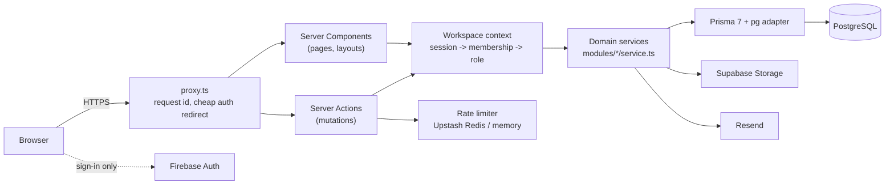

# Architecture

Operiq is a single Next.js application organised by business domain. It is deliberately a
modular monolith: one deployable, one database, clear seams between modules. Splitting a
module into its own service later should be a matter of moving a folder, not untangling it.

## Request flow



1. `src/proxy.ts` (the Next 16 replacement for middleware) tags every request with an
   `x-request-id`, redirects anonymous visitors away from private routes, and marks private
   responses `noindex`. It never decides whether a session is valid; it has no database access.
2. Pages and layouts are Server Components. They call `getWorkspaceContext(slug)`, which loads
   the session, then the membership, then derives permissions.
3. Mutations are Server Actions. Each action validates input with Zod, resolves the workspace
   context again (`requireWorkspaceAction(slug, permission)`), and delegates to a service.
4. Services own the business rules and the database access. They receive a context object,
   so every query is scoped to `context.organization.id`.

## Folder structure

```
src/
  app/                    routes only: pages, layouts, metadata files
    (marketing)/          public site
    (auth)/               login, register, verify, reset
    onboarding/           workspace setup wizard
    invite/[token]/       invitation landing page
    w/[slug]/             everything inside a workspace
  modules/                one folder per domain
    auth/                 Firebase token verification, sessions, auth UI
    organizations/        workspace service, schemas, context, forms
    members/              membership service and the pure role policy
    invitations/          invitation service, token handling, UI
    audit/                append-only audit log
    activity/             product timeline
    notifications/        in-app notifications
    onboarding/           step definitions and wizard UI
    dashboard/            dashboard widgets and rule-based insights
    command/              command bar intent detection
    marketing/            landing page sections
    settings/             settings navigation
    users/                profile service and forms
  components/
    ui/                   shadcn/ui primitives (Radix + Tailwind)
    shared/               app-wide building blocks (avatars, empty states, uploads)
    layout/               workspace shell, sidebar, command palette
  lib/                    infrastructure: db, env, errors, logging, security, storage, email
  config/                 navigation, plans, site metadata, form options
```

A module typically contains:

| File          | Responsibility                                         |
| ------------- | ------------------------------------------------------ |
| `schemas.ts`  | Zod schemas shared by forms and actions                |
| `service.ts`  | Business rules and database access (`server-only`)     |
| `actions.ts`  | Server Actions: validate, authorize, call the service  |
| `policy.ts`   | Pure permission rules, unit tested without a database  |
| `components/` | UI for the module, client components only where needed |

## Rendering choices

- Server Components by default. Client components are limited to forms, menus, the command
  palette and anything that needs browser APIs.
- Every private page is dynamic because it depends on the session cookie. Public pages are
  static and prerendered at build time.
- `react.cache` deduplicates the session and workspace lookups inside one request, so a
  layout and a page asking for the same context hit the database once.
- `after()` is used for non-critical writes (remembering the last opened workspace) so they
  don't delay the response.

## Error handling

- Services throw `AppError` with a code (`FORBIDDEN`, `NOT_FOUND`, `LIMIT_REACHED`, ...).
- `runAction()` turns errors into a typed `ActionResult`. Known errors become friendly messages;
  unknown errors are logged with the request id and replaced by a generic message, so stack
  traces and SQL never reach the browser.
- Route segments have `error.tsx` boundaries, plus `not-found.tsx` and `global-error.tsx`.

## Where the next phases plug in

See [roadmap.md](./roadmap.md). New business modules (CRM, projects, finance) follow the same
shape: a module folder, organization-scoped tables, permission checks through the workspace
context, audit and activity entries for important changes.
