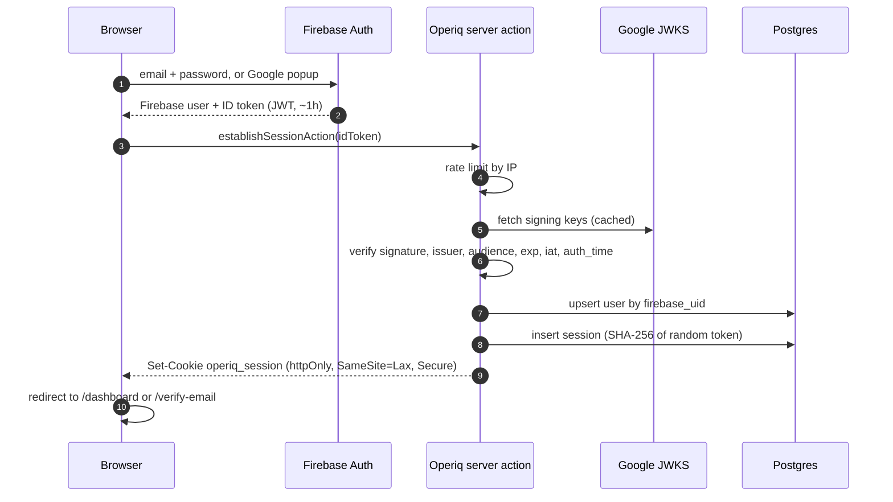

# Authentication

Firebase Authentication proves who someone is. Operiq then issues its own server-side
session. Firebase never decides what a user can access.

## Sign-in sequence

## Why this design

- **No service account key on the server.** ID tokens are verified with `jose` against Google's
  public JWKS, following the checks Firebase documents for third-party JWT libraries. One less
  long-lived secret to protect.
- **Opaque, revocable sessions.** A random 256-bit token lives in an httpOnly cookie. Only its
  SHA-256 hash is stored, so a database leak doesn't leak usable sessions. Revoking a session is a
  row delete and takes effect on the next request.
- **Short trust window for new sessions.** A new session is only created if the Firebase sign-in
  happened in the last 10 minutes (`auth_time`). A leaked ID token can't be replayed to open a
  fresh session later.
- **Sliding expiry.** Sessions last 30 days and are extended at most once a day while in use, which
  keeps writes low.
- **Firebase state in the browser is short-lived.** The Firebase SDK uses session persistence
  (per tab), only for finishing sign-in and email verification.

## Flows

| Flow               | Where                              | Notes                                                                |
| ------------------ | ---------------------------------- | -------------------------------------------------------------------- |
| Register           | `/register`                        | Creates the Firebase user, sets the display name, sends verification |
| Email verification | `/verify-email`, `/auth/action`    | Polls quietly while the tab is visible; manual "I've verified" too   |
| Google sign-in     | Button on `/login` and `/register` | Popup flow; Google accounts arrive verified                          |
| Forgot password    | `/forgot-password`                 | Same response whether or not the account exists                      |
| Reset password     | `/auth/action?mode=resetPassword`  | Needs the custom action URL configured in Firebase                   |
| Sign out           | User menu                          | Deletes the session row, clears the cookie, signs out of Firebase    |
| Active sessions    | Settings, Security                 | Lists devices; revoke one or all others                              |

Unverified users can sign in but are held at `/verify-email` until the `email_verified` claim is
true. Every protected page calls `requireVerifiedUser()`.

## Account linking edge case

If a Firebase account is deleted and recreated with the same email, the new `uid` is relinked to
the existing Operiq user only when the new identity has a verified email. Otherwise anyone could
register an unverified Firebase account with someone else's address and inherit their data.

## Firebase console setup

1. Authentication, Sign-in method: enable **Email/Password** and **Google**.
2. Authentication, Settings, **Authorized domains**: add your production domain
   (localhost is there by default).
3. Authentication, Templates: for the password reset and email verification templates, set the
   **action URL** to `https://your-domain/auth/action`. Without this, Firebase's default hosted
   page handles the link and redirects back, which also works.
4. Keep "Email enumeration protection" on.

The web config values go into the `NEXT_PUBLIC_FIREBASE_*` variables. They identify the project
and are safe to ship to the browser; access is controlled by Firebase itself and by the checks above.
