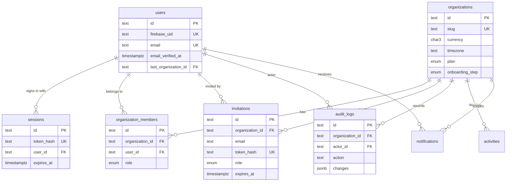

# Database

PostgreSQL through Prisma 7 with the `pg` driver adapter. The schema lives in
`prisma/schema.prisma`, migrations in `prisma/migrations`.

## Entity relationships



## Conventions

- Tables and columns are `snake_case` in Postgres (`@@map` / `@map`) and `camelCase` in
  TypeScript, so the database reads naturally in `psql` and in the app.
- Ids are `cuid`s generated by Prisma: sortable enough, URL safe, and not guessable in sequence.
- Every business table has an `organization_id` foreign key with `ON DELETE CASCADE`.
- Timestamps are `timestamptz`. Enums are real Postgres enums (roles, plans, onboarding steps).

## Indexes and the queries behind them

| Index                                                    | Query it serves                                   |
| -------------------------------------------------------- | ------------------------------------------------- |
| `organization_members (organization_id, user_id)` unique | Resolving the workspace context on every request  |
| `organization_members (user_id)`                         | Workspace switcher, post-login redirect           |
| `organization_members (organization_id, role)`           | Counting owners before role changes               |
| `sessions (token_hash)` unique                           | Session lookup from the cookie                    |
| `sessions (expires_at)`                                  | Cleaning up expired sessions                      |
| `invitations (token_hash)` unique                        | Opening an invitation link                        |
| `invitations (email)`                                    | "You've been invited" list during onboarding      |
| `invitations_pending_email_key` partial unique           | At most one open invitation per email + workspace |
| `audit_logs (organization_id, created_at desc)`          | Audit log page, newest first                      |
| `activities (organization_id, created_at desc)`          | Dashboard activity feed                           |
| `notifications (recipient_id, organization_id, ...)`     | Notification bell and unread count                |

## Things Prisma can't express, kept in migrations

The initial migration adds two pieces of raw SQL after the generated DDL:

1. **Partial unique index** on `invitations (organization_id, email) WHERE accepted_at IS NULL
AND revoked_at IS NULL`. Prisma has no partial index syntax; `prisma migrate diff` confirms
   it doesn't try to drop it.
2. **Append-only trigger** on `audit_logs`. `UPDATE` and `DELETE` raise an error unless the
   transaction runs `SET LOCAL operiq.allow_audit_purge = 'on'`. Two exceptions are allowed:
   the foreign key setting `actor_id` to `NULL` when a user account is deleted, and deleting a
   whole workspace in a transaction that opts in. `TRUNCATE` (used by tests) bypasses row
   triggers.

## Concurrency

- Workspace creation, invitation acceptance and member changes run in transactions.
- Accepting an invitation uses a conditional `UPDATE ... WHERE accepted_at IS NULL`, so two
  clicks can't both succeed.
- Role changes and removals lock the organization row (`SELECT ... FOR UPDATE`) before counting
  owners, which prevents two owners demoting each other at the same moment.

## Connections

- `DATABASE_URL` is the runtime connection. With Supabase, use the transaction pooler
  (port 6543) so serverless functions don't exhaust Postgres connections.
- `DIRECT_URL` is used by `prisma migrate`, which needs a session-level connection.
- The Prisma client is created lazily on first query, so `next build` doesn't need a database.

## Commands

```bash
npm run db:migrate    # create and apply a migration in development
npm run db:deploy     # apply pending migrations (CI, production)
npm run db:seed       # demo workspace "Nova Digital Agency"
npm run db:studio     # browse data
```
