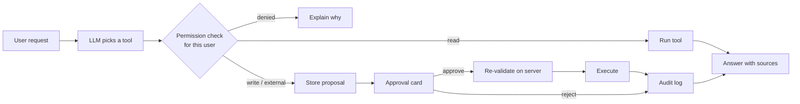
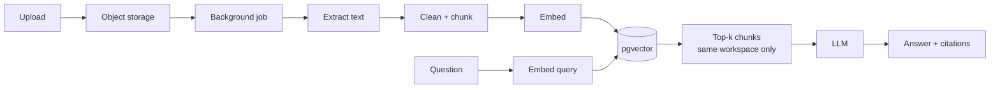

# Roadmap

Operiq is built in phases. Each phase ships complete (data model, server logic, UI, tests)
before the next one starts.

| Phase | Scope                                                                                | Status   |
| ----- | ------------------------------------------------------------------------------------ | -------- |
| 1     | Foundation: auth, workspaces, onboarding, RBAC, invitations, app shell, settings     | **Done** |
| 2     | CRM: customers, contacts, leads, deals, pipeline, tags, notes, search, pagination    | Next     |
| 3     | Projects: projects, tasks, Kanban, list, calendar, comments, attachments             | Planned  |
| 4     | Finance: invoices, PDF generation, public invoice links, payments, expenses          | Planned  |
| 5     | AI agent: streaming chat, typed tools, approvals, AI audit trail                     | Planned  |
| 6     | Document intelligence: uploads, extraction, chunking, embeddings, RAG with citations | Planned  |
| 7     | Automations: triggers, conditions, actions, execution history, retries               | Planned  |
| 8     | Infrastructure: queues, background workers, caching, realtime, monitoring            | Planned  |
| 9     | Billing: subscriptions, usage tracking, billing portal                               | Planned  |
| 10    | Hardening: performance, accessibility audit, nonce-based CSP, MFA                    | Planned  |
| 11    | Presentation: demo workspace, case study, video                                      | Planned  |

## Design notes for upcoming phases

### AI agent (phase 5)

The agent talks to Operiq only through typed tools. Each tool declares a Zod input schema, the
permission it needs, and a risk level:

| Risk       | Examples                              | Behaviour                                         |
| ---------- | ------------------------------------- | ------------------------------------------------- |
| `read`     | search customers, revenue analytics   | runs immediately, scoped to the workspace         |
| `write`    | create task, update lead              | proposed, runs after approval                     |
| `external` | send email, send invoice, delete data | proposed with a full preview, runs after approval |

Tools run with the same workspace context as the user, so the agent can never see or do more
than the person asking. Proposals are stored (`ai_approvals`) so approval is a separate,
authenticated request, and execution re-validates input and permissions at that moment.

### Document intelligence (phase 6)

Chunks carry `organization_id` and `document_id`, vector search always filters by workspace, and
answers cite the chunks they used so claims can be checked against the source.

### Background jobs (phases 6 to 8)

Long work (embeddings, emails, automations, reminders) moves to a queue with retries,
idempotency keys and a job log table. The provider abstraction keeps the choice open between a
Postgres-backed queue and a hosted one.
